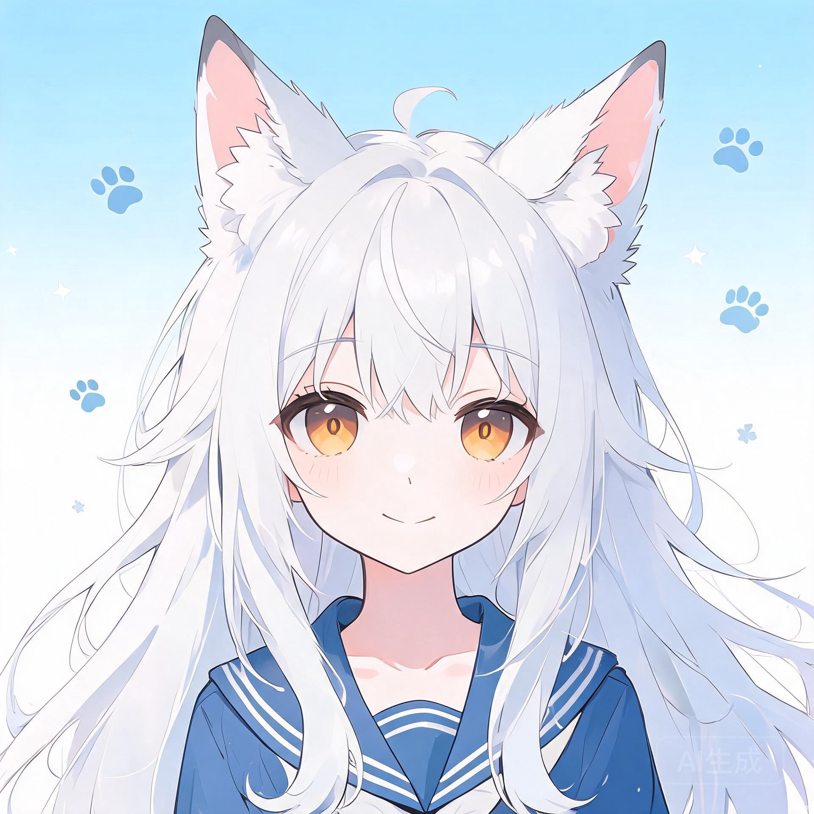

<!-- markdownlint-disable -->

<div align="center">



# 白苏文 (BaiSuWen)

<br>
<div>
    
    
    
</div>
<div>
    
    
    
</div>
<div>
    
    
</div>
<br>

<!-- markdownlint-restore -->

白苏文（BaiSuWen）是一款基于 NoneBot2 与 DeepSeek 的 QQ 智能陪伴机器人

拥有独立角色人格，支持多轮对话、记忆系统、语音交互与多模态理解

部署即用，一键接入你的 QQ，即刻开始与专属 AI 伙伴聊天！

持续更新中......

</div>

## ✨ 功能特性

- **智能对话** — 基于 DeepSeek 大模型，拥有独立的角色人格（狼族少女「小玖」），支持上下文感知的自然对话
- **双层级记忆系统** — 短期 + 长期记忆，基于幂律遗忘曲线的记忆衰减算法，自动去重与合并
- **语音交互** — Whisper 语音识别（ASR）→ VITS 语音合成（TTS），支持 QQ 语音消息的收发
- **多模态理解** — 支持识别聊天图片内容并纳入对话上下文（需使用支持图片理解的 API）
- **用户画像** — 长期追踪用户特征，构建个性化画像
- **情感分析** — 实时检测用户情绪并自适应调整回复风格
- **群聊支持** — 可配置响应概率和冷却时间，支持 @呼唤 和昵称识别
- **WebUI 管理面板** — 浏览器端管理插件、查看/编辑配置、浏览记忆数据、查看审计日志
- **定时休眠** — 可配置休眠时间段，期间自动静默
- **明日方舟-卫戍协议工具箱** — 集成敌人数据查询等游戏辅助功能

## 📁 项目结构

```
baisuwen/
├── src/plugins/
│   ├── nonebot_plugin_update_baisuwen/  # 核心：对话逻辑、LLM 客户端、人格系统
│   ├── nonebot_plugin_memory/           # 记忆管理（遗忘曲线、检索、备份）
│   ├── nonebot_plugin_tts/              # VITS 语音合成
│   ├── nonebot_plugin_asr/              # Whisper 语音识别
│   ├── nonebot_plugin_dialog/           # 多轮对话管理
│   ├── nonebot_plugin_multimodal/       # 多模态图像理解
│   ├── nonebot_plugin_sentiment/        # 情感分析
│   ├── nonebot_plugin_profile/          # 用户画像
│   ├── nonebot_plugin_webui/            # Web 管理后台
│   ├── nonebot_plugin_admin/            # QQ 端管理命令
│   └── nonebot_plugin_strongholdtools/  # 明日方舟-卫戍协议工具箱
├── tools/                               # CLI 工具（记忆管理）
├── docs/                                # 项目文档与图片
├── pyproject.toml                       # 项目配置与依赖
└── .env.example                         # 配置模板
```

## 🚀 快速开始

### 前置准备

1. **QQ 机器人框架** — 本项目使用 OneBot V11 协议，推荐以下实现：
   - [LLOneBot / LuckyLilliaBot](https://github.com/LLOneBot/LuckyLilliaBot) — 基于 OneBot 的 QQ 机器人后端
   - [LuckyLilliaDesktop](https://github.com/LLOneBot/LuckyLilliaDesktop.Avalonia) — 桌面端管理工具
   - 也可使用其他 OneBot 实现（如 [Lagrange](https://github.com/LagrangeDev/Lagrange.Core)、[NapCat](https://github.com/NapNeko/NapCatQQ)）

2. **模型文件** — VITS 语音合成依赖预训练模型，需从 GitHub Releases 下载：
   - 前往 [Releases 页面](https://github.com/Longxuanyue/QQBot-Baisuwen/releases) 下载最新版 `models.zip`（或单独的 `G_latest.pth` + `finetune_speaker.json`）
   - 将文件放入项目根目录下的 `models/` 文件夹
   - 在 `.env` 中配置 `TTS_MODEL_PATH` 和 `TTS_CONFIG_PATH`

3. **NoneBot 插件** — 本项目可选以下外部插件，请从 NoneBot 插件商店安装：
   - [nonebot-plugin-skland](https://github.com/FrostN0v0/nonebot-plugin-skland) — 明日方舟森空岛插件-通过森空岛查询游戏数据

4. **修改 Bot 人设** — 仓库中的 `src/plugins/nonebot_plugin_update_baisuwen/personality_traits.json` 为作者私设，请替换为你自己的角色设定：
   - 编辑该文件，修改角色名称、性格、背景故事、口癖等内容
   - 格式为 JSON，字段含义参见文件内注释

### 环境要求

- Python >= 3.10
- CUDA（可选，用于 ASR/TTS 加速）

### 安装

```bash
# 1. 克隆仓库
git clone https://github.com/<你的用户名>/baisuwen.git
cd baisuwen

# 2. 创建虚拟环境
python -m venv venv
source venv/bin/activate  # Linux/Mac
# venv\Scripts\activate   # Windows

# 3. 安装依赖
pip install -e .
pip install -r requirements.txt

# 4. 配置环境变量
cp .env.example .env
# 编辑 .env，填入你的 DeepSeek API Key、QQ 号等配置

# 5. 启动
nb run --reload
```

### 配置说明

参考 `.env.example` 中的注释。核心必填项：

| 配置项 | 说明 |
|--------|------|
| `DEEPSEEK_API_KEY` | DeepSeek API 密钥，从 [platform.deepseek.com](https://platform.deepseek.com/api_keys) 获取 |
| `SUPERUSERS` | 超级用户（主人）QQ 号 |
| `ENABLE_MULTIMODAL` | 是否启用多模态图像理解（需使用支持图片理解的 API 模型） |
| `ENABLE_ASR` | 是否启用语音识别（需 GPU） |
| `ENABLE_TTS` | 是否启用语音合成（需 GPU） |

> ⚠️ **多模态图像理解** 需要你所使用的 API 支持图片输入（vision 能力）。请在 `.env` 中开启 `ENABLE_MULTIMODAL=true` 并确保你的 API 模型具备多模态能力。

## 🎤 语音合成（TTS）

本项目现已支持 **GPT-SoVITS** 与 **VITS** 两种模型进行语音合成：

- **VITS** — 项目内 VITS 模块已精简化，用户仅需完成 VITS 模型的训练即可，无需再单独部署 VITS 推理服务
- **GPT-SoVITS** — 需要用户在本地部署 GPT-SoVITS 服务端后才可以正确调用

模型训练基于 [VITS-fast-fine-tuning](https://github.com/Plachtaa/VITS-fast-fine-tuning)，请参考该仓库完成：

1. 准备训练音频数据集
2. 使用 VITS-fast-fine-tuning 进行微调训练
3. 将训练好的模型文件（`.pth`）和配置文件（`.json`）放入 `models/` 目录
4. 在 `.env` 中配置 `TTS_MODEL_PATH` 和 `TTS_CONFIG_PATH`

> 💡 **不想自行训练？** 可直接使用项目预训练模型。前往 [Releases](https://github.com/Longxuanyue/QQBot-Baisuwen/releases) 下载模型文件，放入 `models/` 目录即可。

## 📄 License

本项目基于 MIT 协议开源。详见 [LICENSE](LICENSE) 文件。

## 💝 致谢

- [NoneBot2](https://github.com/nonebot/nonebot2) — 跨平台 Python 异步机器人框架
- [DeepSeek](https://platform.deepseek.com/) — 大语言模型 API
- [VITS-fast-fine-tuning](https://github.com/Plachtaa/VITS-fast-fine-tuning) — VITS 快速微调方案
- [GPT-SoVITS](https://github.com/RVC-Boss/GPT-SoVITS) — 语音合成模型（致谢：花儿不哭、红血球AE3803、白菜工厂1145号员工，以及为 GPT-SoVITS 提供支持与指导手册的所有工作者）
- [game-event-progress](https://github.com/hualeide/game-event-progress) — 游戏新闻动态获取
- [OpenAI Whisper](https://github.com/openai/whisper) — 语音识别模型
- [nonebot-plugin-skland](https://github.com/FrostN0v0/nonebot-plugin-skland) — 明日方舟森空岛插件-通过森空岛查询游戏数据
- [LLOneBot / LuckyLilliaBot](https://github.com/LLOneBot/LuckyLilliaBot) — QQ 机器人 OneBot 实现
- [LuckyLilliaDesktop](https://github.com/LLOneBot/LuckyLilliaDesktop.Avalonia) — 桌面端管理工具
